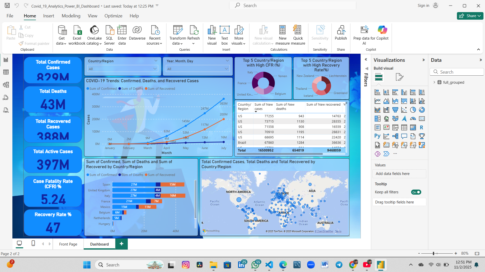

# 🦠 COVID-19 Analytics Power BI Dashboard

### 📊 Project Overview
This Power BI project analyzes the global impact of COVID-19 using interactive dashboards.  
It visualizes **confirmed cases, recoveries, deaths, and trends over time**, allowing users to explore data by **country, region, and timeline**.

---

### 🧰 Tools & Technologies
- **Power BI Desktop**
- **Microsoft Excel / CSV datasets**
- **Data Modeling & DAX Calculations**
- **Data Visualization & Dashboard Design**

---

### 📈 Dashboard Features
✅ Global summary cards for Total Cases, Recoveries, and Deaths  
✅ Interactive map showing COVID-19 spread by country  
✅ Line chart showing daily/weekly case trends  
✅ Top 10 affected countries visualization  
✅ Filter by date range and continent  
✅ Insights highlighting recovery & fatality ratios  

---

### 🧮 Data Sources
- [World Health Organization (WHO)](https://www.who.int/)
- [Our World in Data](https://ourworldindata.org/coronavirus)
- Public COVID-19 datasets (CSV/Excel files imported into Power BI)

---

### 🚀 How to Open the Dashboard
1. Download the `.pbix` file from this repository.
2. Open it using **Power BI Desktop**.
3. Explore the dashboard and interact with filters, maps, and visuals.

---

### 📚 Learning Objectives
- Understand data cleaning and transformation using Power Query  
- Build relationships between datasets  
- Create KPIs, measures, and calculated columns using DAX  
- Design professional dashboards with interactive visuals  

---

### 👨‍💻 Author
**Ganesh Kumar Verma**  
📧 [bibekverma21@gmail.com](mailto:bibekverma21@gmail.com)  
🔗 [LinkedIn](https://www.linkedin.com/in/ganesh-verma108/)

---

### 🏆 Acknowledgments
Special thanks to Shri Ramswaroop Memorial University and mentors for their guidance and support in data analytics and Power BI visualization.

---

### 🖼️ Preview 

